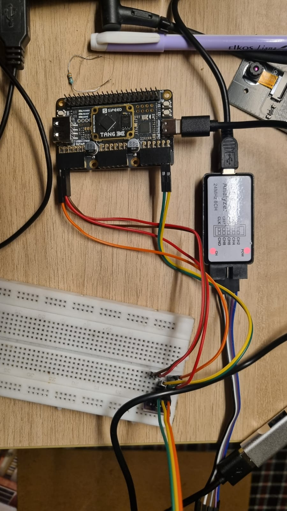
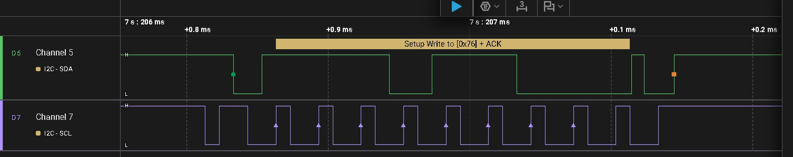

# 02 I2C BME280 - Chip Identification Phase

This project implements a bit-banged I2C Master on the Tang Nano 25K to communicate with a BME280 environmental sensor.

## Current Progress: Address Handshake
The current Verilog implementation successfully performs the following:
1. **START Condition**: SDA pulled low while SCL is high.
2. **Device Addressing**: Sends `0x76` (7-bit address) + `0` (Write bit).
3. **ACK Detection**: Monitors the SDA line for the sensor's acknowledgment.
4. **STOP Condition**: SCL high followed by SDA rising.

## Hardware Setup

*The general setup showing the Tang Nano 25K connected to the BME280 sensor and the Saleae Logic Analyzer probes.*

## Logic Analysis
Using the Saleae Logic software, we have verified that the sensor is responding correctly to its address.

*Waveform captured at 100kHz showing the address frame and the ACK bit from the BME280.*

## Pin Mapping (GW5A-25)
| Signal | Pin | IO Type |
|--------|-----|---------|
| CLK    | E2  | LVCMOS33|
| SCL    | D11 | LVCMOS33|
| SDA    | G11 | LVCMOS33|

## Next Steps
- [ ] Implement **Register Selection** to point to `0xD0` (Chip ID).
- [ ] Implement **Repeated Start** (Sr) condition.
- [ ] Read the 8-bit ID back from the sensor (Expected: `0x60`).
